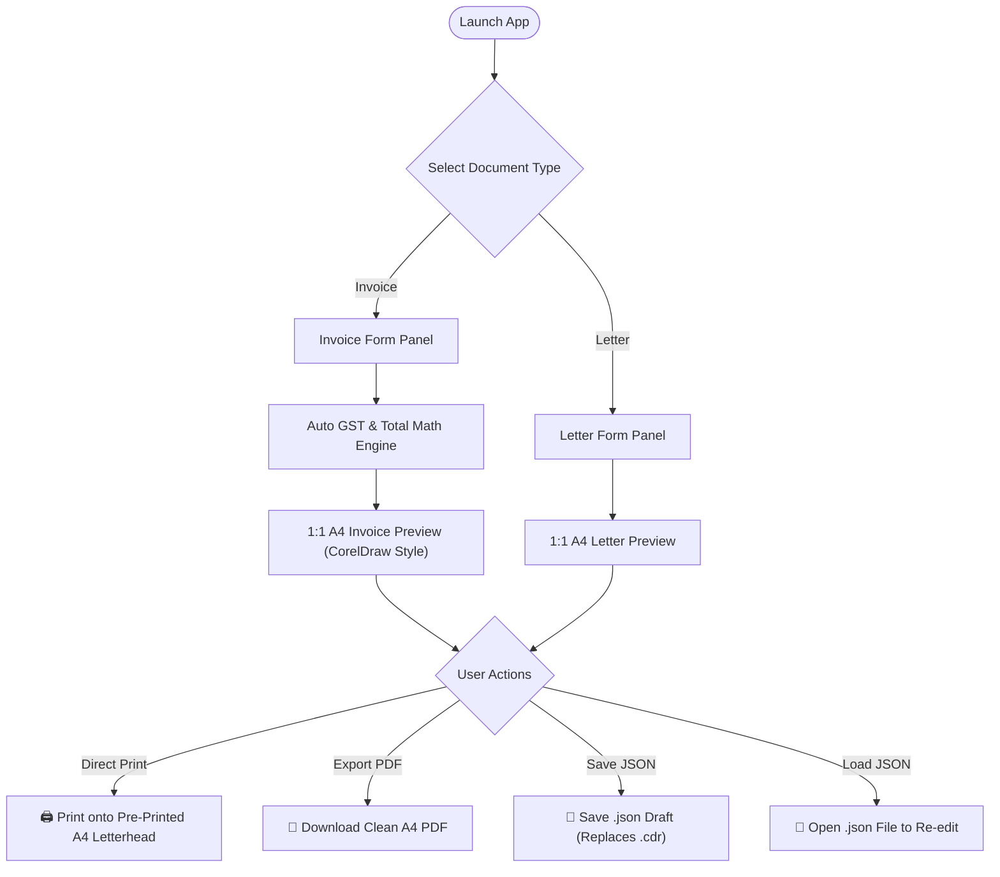
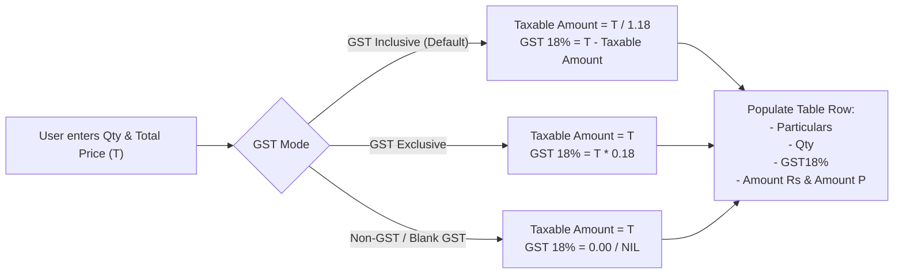

# Product Requirements Document (PRD) — v1.0

## Rainbow Offset — Invoice & Letter Generator Web Application

---

## 1. Project Overview & Objectives

### 1.1 Background

**Rainbow Offset** is a commercial offset printing press that produces books, letterheads, brochures, visiting cards, forms, and custom stationery. Currently, the team uses **CorelDraw** on a daily basis to lay out client invoices and official business letters manually. These files are saved as `.cdr` files on local drives so they can be edited later, and sent directly to office laser printers loaded with **pre-printed A4 letterhead paper** (with the company header pre-printed at the top).

### 1.2 Problem Statement

- **Inefficient Workflow**: CorelDraw is a vector design software, not an invoicing or document tool. Creating simple invoices requires manual alignment, manual text editing, and external calculators.
- **Error-Prone Calculations**: Calculating 18% GST (CGST 9% + SGST 9%), deriving base amounts from inclusive figures, and computing round-offs manually lead to frequent calculation errors.
- **File Management Friction**: Managing, searching, and reopening hundreds of `.cdr` files just to check or edit an invoice is tedious and slow.
- **Print Alignment Hassle**: Staff must manually leave space at the top so that text does not print over the pre-printed physical company letterhead header.

### 1.3 Solution & Scope

Build a clean, high-performance, **100% Client-Side Web Application** (React 19, TypeScript, Tailwind CSS, Vite, OXC toolchain).

- **Zero API / Backend / Database**: Operates entirely in the browser, works offline, and requires no hosting servers or external databases.
- **JSON Drafts to Replace `.cdr` Files**: Supports `Save Draft (.json)` and `Load Draft (.json)` so users can save invoices/letters to disk and reload them anytime for editing.
- **1-Click A4 Direct Print & PDF Download**: Features a calibrated `@media print` stylesheet formatted for standard A4 (`210mm x 297mm`) with customizable letterhead top offsets.
- **Exact Layout Replication**: Matches the exact visual structure, typography, table columns, and bank details from the reference invoice (`Downloads/form-example.jpeg`).

---

## 2. Document Types & User Flow



---

## 3. Invoice Generator Specification

### 3.1 Invoice Header & Client Details

The top section replicates the dual-box layout from the CorelDraw reference:

| Field                | Input Type       | Requirement | Description / Behavior                                       |
| :------------------- | :--------------- | :---------- | :----------------------------------------------------------- |
| **Document Pill**    | Static / Display | Mandatory   | Displays **`INVOICE BILL`** in a centered rounded pill badge |
| **Client Name**      | Text Input       | Required    | Displayed as `M/s. [Client Name]` (e.g. `HOTEL GNANAM`)      |
| **Client Address**   | Multiline Text   | Required    | Multi-line street address, city, state, pin code             |
| **Client GSTIN**     | Text Input       | Optional    | 15-character GST number (e.g. `33AADFH1286J1ZG`)             |
| **Bill No**          | Text / Number    | Conditional | Displayed if GST is entered or provided manually (e.g. `16`) |
| **State Code**       | Text Input       | Required    | Defaults to `33` (Tamil Nadu)                                |
| **Invoice Date**     | Date Picker      | Required    | Formatted as `DD.MM.YYYY` (e.g. `19.08.2026`)                |
| **Calculation Mode** | Switch Toggle    | Required    | **GST Inclusive (Default)** vs **GST Exclusive**             |

---

### 3.2 Line Items & Calculation Engine

Users input:

1. **Particulars** (Job description: e.g. `MD MEMO A6`, `Letter pad sheet`, `Visiting card`)
2. **Quantity** (e.g. `10`, `1000`, `500`)
3. **Total Price** (User always enters the total amount, e.g. `5000` for `100` qty)

#### Mathematical Logic:



#### Detailed Example:

- **Case 1: GST Inclusive (Default)**
  - User enters Qty = `100`, Total Price = `₹5,000`.
  - Base Amount = `5000 / 1.18 = 4237.29` (`Rs: 4237`, `P: 29`).
  - GST 18% = `5000 - 4237.29 = 762.71`.
- **Case 2: GST Exclusive**
  - User enters Qty = `10`, Base Amount = `₹700`.
  - GST 18% = `700 * 0.18 = 126.00`.
  - Amount = `₹700.00` (`Rs: 700`, `P: 00`).
  - Total = `₹826.00`.

---

### 3.3 Printed Table Structure

The table replicates the exact borders and columns of the CorelDraw template:

```
+-------+-----------------------------+-------+---------+--------+------+
| S.No. | PARTICULARS                 |  Qty. |  GST18% | Amount |      |
|       |                             |       |         |   Rs   |  P   |
+-------+-----------------------------+-------+---------+--------+------+
|   1   | MD MEMO A6                  |    10 |  126.00 |    700 |  00  |
|   2   | Letter pad sheet            |  1000 |  360.00 |   2000 |  00  |
|   3   | Tariff                      |   500 |  180.00 |   1000 |  00  |
|   4   | Visiting card               |  1000 |  360.00 |   2000 |  00  |
|   5   | Room Entry Form 1 + 2       |    10 |  360.00 |   2000 |  00  |
|   6   | Room Booking Form           |    10 |  180.00 |   1000 |  00  |
|   7   | Buffet Menu card            |   100 |   90.00 |    500 |  00  |
|       |                             |       |         |        |      |
|       | [Auto-filled empty space]   |       |         |        |      |
|       |                             |       |         |        |      |
+-------+-----------------------------+-------+---------+--------+------+
|                                             | 1656.00 |   9200 |  00  |
+---------------------------------------------+---------+--------+------+
```

- **Table Subtotal Row**:
  - Total GST = Sum of all row GST amounts (`1656.00`).
  - Total Taxable Amount = Sum of all base amounts (`9200` Rs, `00` P).

---

### 3.4 Tax Summary & Grand Total Bar

Immediately below the line item table:

```
+----------------+----------------+----------------+-------------+-------+----+
| Gst Rs.1656.00 | CGST Rs.828.00 | SGST Rs.828.00 | GRAND TOTAL | 10856 | 00 |
+----------------+----------------+----------------+-------------+-------+----+
```

- **GST Rs.**: Total GST Amount.
- **CGST Rs.**: Half of GST (`GST Total / 2`).
- **SGST Rs.**: Half of GST (`GST Total / 2`).
- **GRAND TOTAL**: Total Base Amount + Total GST.
- **Round-off**: Automatic integer rounding with exact Paise (`00`) alignment.
- **Non-GST Handling**: If Non-GST, all tax boxes display `0.00` or `NIL`, and Grand Total equals the subtotal.

---

### 3.5 Static Account Details & Authorized Signatory

Exact static details permanently pre-configured at the bottom of the invoice:

```
+-------------------------------------------------------------------------------+
| Account Details                                    For Rainbow Offset Printer |
| Name: RAINBOW OFFSET PRINTING                                                 |
|       PUBLISHING AND TRADING                                                  |
| No: 6912675908                                                                |
| IFSC Code: IDIB000N133                                                        |
| Indian Bank                                           Authorised Signature    |
+-------------------------------------------------------------------------------+
```

---

## 4. Letter Generator Specification

For generating official communications, estimates, quotation cover letters, or notices:

### 4.1 Fields

- **Date**: Formatted as `DD.MM.YYYY` or standard text date (e.g. `19th August 2026`).
- **Reference / Letter No**: Optional (e.g. `REF: RO/2026-27/L-102`).
- **To / Recipient Block**:
  - Name (e.g. `The Managing Director`)
  - Organization / Department (e.g. `Hotel Gnanam`)
  - Address (e.g. `Anna Salai, Keelavasal, Thanjavur - 613001`)
- **Subject**: Formatted as `Sub: [Subject Text]` (bold/underlined).
- **Salutation**: `Dear Sir / Madam,` or custom salutation.
- **Body Paragraphs**: Clean multi-line text area supporting multiple paragraphs with standard letter spacing and line height.
- **Signatory Block**:
  - `Yours faithfully,`
  - `For Rainbow Offset Printer`
  - `[Blank Signature & Seal Space]`
  - `Authorised Signature`

---

## 5. Physical Letterhead Offset & Print Calibration

### 5.1 The Letterhead Problem

Rainbow Offset prints onto pre-printed letterheads where the top 50mm–65mm of the A4 sheet is already occupied by the physical printed company logo and address banner.

### 5.2 The Solution: Calibration Engine

- **Top Offset Margin Slider**: User-adjustable from `0mm` to `100mm` (Default: `55mm`).
- **Left / Right Margin Sliders**: `10mm` to `25mm` (Default: `15mm`).
- **Print Preview Toggle**:
  - **"Pre-Printed Letterhead Mode"**: Top space is rendered as empty white space, pushing the printable invoice/letter content exactly below the physical header.
  - **"Digital Header Mode"**: Renders the digital Rainbow Offset banner for digital PDF distribution and plain white paper printing.

---

## 6. UI / UX Architecture

### 6.1 Split-Pane Layout (Desktop Optimized)

```
+------------------------------------------------------------------------------------------------+
|  🌈 Rainbow Offset Tools     [+ New Invoice] [+ New Letter]     [💾 Save JSON] [📂 Open] [🖨️ Print] |
+----------------------------------------------------+-------------------------------------------+
|  LEFT PANEL: Controls & Form                       |  RIGHT PANEL: 1:1 Live A4 Canvas          |
|                                                    |                                           |
|  [▼ Client & Bill Details]                         |  +-------------------------------------+  |
|  - Client Name: [ HOTEL GNANAM                   ] |  |           [ INVOICE BILL ]          |  |
|  - Address:     [ 84/14-A, Anna Salai...         ] |  | M/s. HOTEL GNANAM   Bill No: 16     |  |
|  - GSTIN:       [ 33AADFH1286J1ZG                ] |  | GST: 33AADFH1286... Date: 19.08.2026|  |
|  - Bill No:     [ 16   ]  State Code: [ 33 ]       |  +-------------------------------------+  |
|                                                    |  | S.No | PARTICULARS | Qty | GST | Amt|  |
|  [▼ Tax Calculation Mode]                          |  | 1    | MD MEMO A6  | 10  | 126 | 700|  |
|  (•) GST Inclusive (Default)  ( ) GST Exclusive    |  | 2    | Letter pad  | 1000| 360 |2000|  |
|                                                    |  +-------------------------------------+  |
|  [▼ Line Items]                                    |  | GST Rs. 1656 | GRAND TOTAL: 10856   |  |
|  1. [ MD MEMO A6         ] [ 10  ] [ ₹700  ] [x]   |  +-------------------------------------+  |
|  2. [ Letter pad sheet   ] [ 1000] [ ₹2000 ] [x]   |  | Account Details        For Rainbow..|  |
|  [+ Add Item Row]                                  |  +-------------------------------------+  |
|                                                    |                                           |
|  [▼ Letterhead Offset Calibration]                 |  [Zoom: 75% | 100% | Fit Page]            |
|  Top Blank Margin: [===O=======] 55mm              |                                           |
+----------------------------------------------------+-------------------------------------------+
```

---

## 7. Data Models & JSON Schema

```typescript
export interface LineItem {
  id: string;
  particulars: string;
  quantity: number;
  totalPrice: number; // Always entered by user
}

export interface InvoiceData {
  documentType: "invoice";
  billNo: string;
  date: string; // "DD.MM.YYYY"
  stateCode: string; // "33"
  isGstInclusive: boolean; // true by default
  gstRate: number; // 18 by default
  client: {
    name: string;
    address: string;
    gstin?: string;
  };
  items: LineItem[];
  letterheadOffsetMm: number; // e.g. 55
  showDigitalHeader: boolean;
}

export interface LetterData {
  documentType: "letter";
  referenceNo?: string;
  date: string;
  recipient: {
    name: string;
    organization?: string;
    address: string;
  };
  subject: string;
  salutation: string;
  body: string;
  letterheadOffsetMm: number;
  showDigitalHeader: boolean;
}
```

---

## 8. Implementation Steps

1. **Core Math & Types**: Define calculation engine for GST Inclusive/Exclusive/Non-GST derivations, Rs/P split, and rounding.
2. **A4 CorelDraw-Style Template Component**: Build pixel-identical A4 Invoice and Letter components matching `form-example.jpeg`.
3. **Form & Line Items Manager**: Create dynamic form controls with auto-updating live preview.
4. **Letterhead Offset Calibration**: Implement real-time top-margin adjustment slider with `@media print` styling.
5. **Autosave & JSON Drafts**: Implement `localStorage` persistence and `.json` file save/load.
6. **Print & PDF Engine**: Wire standard browser print (`window.print()`) with single-page A4 CSS rules.
